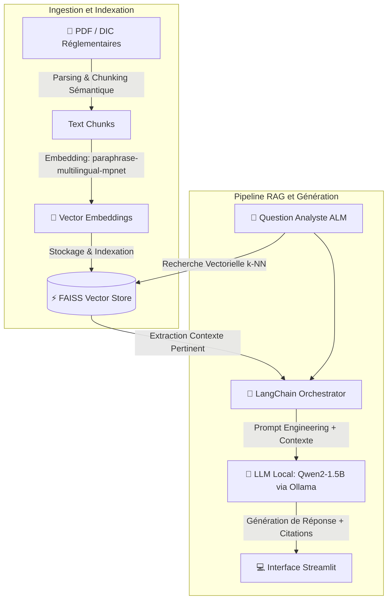

# 🏦 RAG ALM - Assistant Conversationnel sur Documentation Financière

[](https://github.com/Abdata92/rag_alm_project/actions)
[](https://www.python.org/)
[](https://python-poetry.org/)
[](https://www.docker.com/)
[](https://ollama.com/)
[](LICENSE)

> **Assistant IA local, souverain et hautement prévisible** conçu pour accélérer l'analyse des Documents d'Informations Clés (DIC) au sein des départements Asset & Liability Management (ALM) en assurance-vie.

---

## 🎯 Problématique Métier & Valeur Ajoutée

Les équipes **ALM (Gestion Actif/Passif)** analysent quotidiennement des volumes conséquents de documents réglementaires européens (DIC) émis par les sociétés de gestion. L'extraction manuelle de métriques complexes (profil de risque, coûts, indicateurs de performance, maturités) est **chronophage et sujette au risque opérationnel**.

**La Solution :** Un agent RAG (Retrieval-Augmented Generation) sur architecture 100 % locale pour :
* **Garantir la confidentialité absolue** des données financières internes (aucun appel d'API vers des services tiers cloud).
* **Accélérer la prise de décision** grâce à des réponses synthétiques en langage naturel.
* **Éliminer le risque d'hallucination** grâce à une traçabilité stricte (sourcing dynamique des passages sources).

---

## 📊 Performances & Métriques d'Évaluation (KPIs)

Pour valider l'approche en conditions réelles, le pipeline a été soumis à un **benchmark de validation automatisé de 619 requêtes financières complexes**.

| Métrique / KPI | Résultat Obtenu | Objectif / Exigence | Statut |
| :--- | :---: | :---: | :---: |
| **F1 BERTScore** | **71.36 %** | $\ge 60.00 \%$ | ✅ Validé |
| **Taux de Succès d'Inférence** | **100 %** *(0 erreur / 619)* | $100 \%$ | ✅ Validé |
| **Confidentialité / Souveraineté** | **100 % On-Premise** | Strictement Local | ✅ Validé |

---

## 🏗️ Architecture du Pipeline RAG




---

## 🛠️ Stack Technique & Standard Engineering

* **LLM Local :** `Qwen2-1.5B` via **Ollama** (Inférence locale, latence faible, souveraineté totale).
* **Embeddings :** `sentence-transformers/paraphrase-multilingual-mpnet-base-v2` (Spécifiquement finetuné pour la recherche multilingue FR/EN).
* **Vector Database :** **FAISS** (*Facebook AI Similarity Search*) pour une recherche de similarité $k$-NN ultra-rapide.
* **Orchestration :** **LangChain** (Pipeline RAG, mémoire conversationnelle interactive, gestion des prompts).
* **Interface Utilisateur :** **Streamlit** (Interface conversationnelle ergonomique avec nettoyage de session en un clic).
* **Packaging & MLOps :**
* **Gestionnaire de dépendances :** **Poetry** (reproductibilité stricte via `poetry.lock`).
* **Conteneurisation :** **Docker** & `docker-compose`.
* **CI/CD :** **GitHub Actions** (Linting, exécution automatique des tests unitaires `pytest` et build de l'image).


---

## 📂 Structure du Dépôt

```bash
rag_alm_project/
├── .github/workflows/    # Pipelines CI/CD (Automation tests & builds)
├── data/
│   └── evaluation/       # Dataset de benchmark (619 requêtes de test)
├── src/                  # Code source modularisé
├── tests/                # Tests unitaires & d'intégration (pytest)
├── vector_db/            # Index vectoriel FAISS persistant
├── Dockerfile            # Conteneurisation de l'application
├── pyproject.toml        # Configuration des dépendances Poetry
├── main_evaluator.py     # Script d'évaluation automatisé (BERTScore)
├── main_parse_emb_vect.py# Pipeline d'ingestion et d'embedding des documents
├── main_llm_rag.py       # Moteur d'inférence RAG & Orchestration LLM
└── app.py                # Interface utilisateur Streamlit

```

---

## 🚀 Guide de Démarrage Rapide (Quickstart)

### Prérequis

* [Docker](https://www.docker.com/) & [Docker Compose](https://docs.docker.com/compose/)
* [Ollama](https://ollama.com/) installé localement avec le modèle Qwen2 :
```bash
ollama pull qwen2:1.5b

```


### 1. Cloner le Projet

```bash
git clone [https://github.com/Abdata92/rag_alm_project.git](https://github.com/Abdata92/rag_alm_project.git)
cd rag_alm_project

```

### 2. Lancement Rapide via Docker

```bash
docker build -t rag-alm-app .
docker run -p 8501:8501 rag-alm-app

```

L'application Streamlit sera immédiatement accessible sur `http://localhost:8501`.

### 3. Utilisation en Développement Local (avec Poetry)

```bash
# Installation des dépendances
poetry install

# Exécution des tests unitaires
poetry run pytest

# Lancement de l'évaluation du modèle
poetry run python main_evaluator.py

# Lancement de l'application web
poetry run streamlit run app.py

```

---

## 👤 Auteur & Contact

**Abel FOUOBE** – *Senior Data Scientist / ML Engineer*

* **GitHub :** [@Abdata92](https://www.google.com/search?q=https://github.com/Abdata92)
* **Projet :** RAG ALM Financial Assistant

```

```
